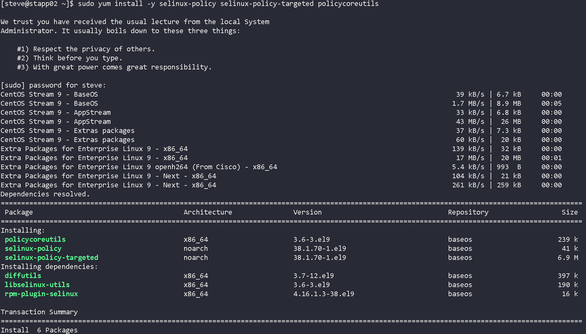
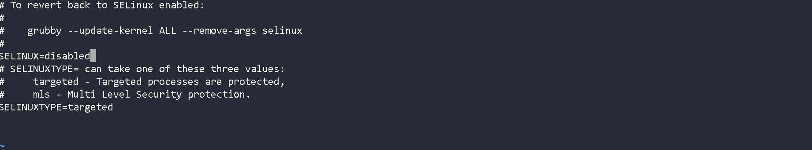
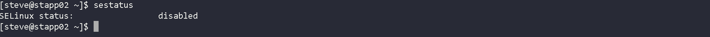

# Rhel1
This project demonstrates core skills in Linux Security Administration and Change Management, aligned with enterprise security operations. The objective was to install required SELinux tooling and permanently disable SELinux on a production application server while adhering to strict operational constraints, including no immediate reboot and persistence across system restarts.

This lab simulates a real-world post-audit scenario where security controls must be staged, validated, and applied during approved maintenance windows.

### Skills Learned

- SELinux Fundamentals: Understanding SELinux architecture, enforcement modes, and policy requirements.

- Persistent Security Configuration: Differentiating between runtime changes and permanent system-level configuration.

- Enterprise Change Management: Implementing security changes without disrupting uptime or violating maintenance policies.

- Linux Package Management: Installing and validating security-related packages on RHEL-based systems.

- Post-Reboot Validation: Verifying security state after system-level changes are applied.

### Tools Used

- yum (Package Management)
- SELinux Utilities (sestatus, getenforce)
- vi (Configuration Editing)
- CentOS Stream 9 (RHEL-based OS)

## Steps

*Ref 1: SELinux Package Installation

- Installed required SELinux policy and management packages
-  Ensured the system was prepared for future SELinux policy configuration and enforcement.
-  This step is commonly required by auditors even if SELinux is temporarily disabled.

*Ref 2: SELinux Package Installation

- Modified /etc/selinux/config to permanently disable SELinux.
-  Avoided using setenforce 0, which only applies temporarily and does not persist across reboots.
-  This change ensures SELinux remains disabled after the next scheduled maintenance reboot.

*Ref 3: SELinux Staus Verification

- Confirmed SELinux status as disabled.
-  Verified the system-level security state aligned with the change request.
-  Validation confirms the requirement was met without requiring an immediate reboot.

### Security and Operational Context
- SELinux cannot be fully disabled without a reboot; configuration must be staged in advance.
- Enterprise systems often enforce strict reboot windows to prevent downtime.
- This workflow reflects real production environments where security posture changes are carefully controlled and documented.

### Final Reflections
This lab successfully demonstrated enterprise-grade Linux security administration by implementing a persistent SELinux configuration change without violating operational constraints. The task reinforced the importance of understanding how Linux security controls behave across reboots and how administrators must balance security requirements with uptime and change-management discipline.

This structured approach mirrors real-world Linux SysAdmin, Security Operations, and RHCSA-aligned responsibilities, making it a strong portfolio artifact for infrastructure and security-focused roles.
